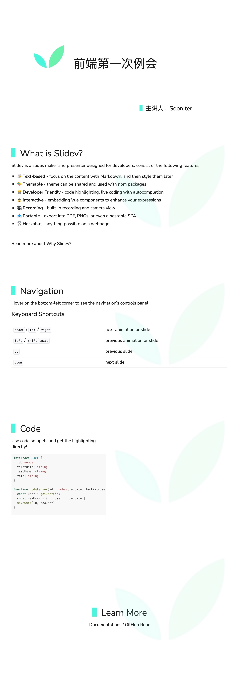

# slidev-theme-flyingstudio

A "flyingstudio" theme for [Slidev](https://github.com/slidevjs/slidev).

## Install

Add the following frontmatter to your `slides.md`. Start Slidev then it will prompt you to install the theme automatically.

<pre><code>---
theme: <b>flyingstudio</b>
---</code></pre>

Learn more about [how to use a theme](https://sli.dev/themes/use).

## ScreenShots

